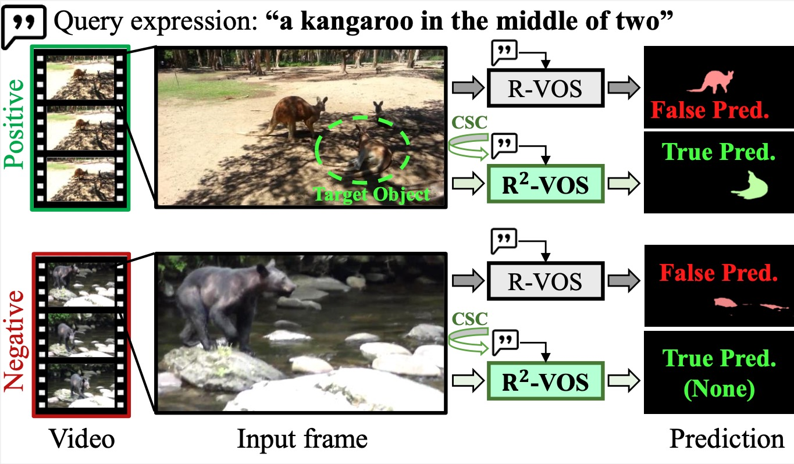

> [**Towards Robust Referring Video Object Segmentation with Cyclic Relational Consistency**](https://arxiv.org/abs/2207.01203)
>
> Xiang Li, Jinglu Wang, Xiaohao Xu, Xiao Li, Bhiksha Raj, Yan Lu

<p align="center"></p>

# Updates
- **(2023-05-30)** Code released.
- **(2023-07-13)** R2VOS is accepted to ICCV 2023!

# Install

```
pip install torch==1.13.0 torchvision==0.14.0 torchaudio==0.13.0 --extra-index-url https://download.pytorch.org/whl/cu118
pip install -r requirements.txt 
pip install 'git+https://github.com/facebookresearch/fvcore' 
pip install -U 'git+https://github.com/cocodataset/cocoapi.git#subdirectory=PythonAPI'
cd models/ops
python setup.py build install
cd ../..
```

Using CUDA version: cuda_11.7.r11.7/compiler.31294372_0

# Docker
You may try [docker](https://hub.docker.com/r/ang9867/refer) to quick start.

# Weights
Please download and put the [checkpoint.pth](https://drive.google.com/file/d/1gknDDMxWKqZ7yPuTh1fome1-Ba4f_G9K/view?usp=share_link) in the main folder.

# Run demo:
Inference on images in the demo/demo_examples.
```
python demo.py --with_box_refine --binary --freeze_text_encoder --output_dir=output/demo --resume=checkpoint.pth --backbone resnet50 --ngpu 1 --use_cycle --mix_query --neg_cls --is_eval --use_cls --demo_exp 'a big track on the road' --demo_path 'demo/demo_examples'
```
# Data Setup
The surf and hockey data subsets were taken from the Ref-DAVIS17 dataset installation instructions found at: https://github.com/wudongming97/OnlineRefer/blob/master/docs/data.md.

The dog_13 data subset was taken from the dog subset of the dataset found at: https://huggingface.co/datasets/l-lt/LaSOT.

Necessary data used to evaluate the model can be found in the demo/ folder.

# Evaluate Model
Evaluate model on surf data.
```
python demo.py --with_box_refine --binary --freeze_text_encoder --output_dir=output/wave_surf --resume=checkpoint.pth --backbone resnet50 --ngpu 1 --use_cycle --mix_query --neg_cls --is_eval --use_cls --demo_exp 'a man surfing in ocean' --demo_path 'demo/wave_surf'
```

Evaluate model on hockey data.
```
python demo.py --with_box_refine --binary --freeze_text_encoder --output_dir=output/hockey --resume=checkpoint.pth --backbone resnet50 --ngpu 1 --use_cycle --mix_query --neg_cls --is_eval --use_cls --demo_exp 'a man with a hockey stick' --demo_path 'demo/hockey'
```

Evaluate model on dog data.
```
python demo.py --with_box_refine --binary --freeze_text_encoder --output_dir=output/dog --resume=checkpoint.pth --backbone resnet50 --ngpu 1 --use_cycle --mix_query --neg_cls --is_eval --use_cls --demo_exp 'dogs playing' --demo_path 'demo/dog'
```


# Inference:
If you want to evaluate on Ref-YTVOS, you may try inference_ytvos.py or inference_ytvos_segm.py if you encounter OOM for the entire video inference.
```
python inference_ytvos.py --with_box_refine --binary --freeze_text_encoder --output_dir=output/eval --resume=checkpoint.pth --backbone resnet50 --ngpu 1 --use_cycle --mix_query --neg_cls --is_eval --use_cls --ytvos_path=/data/ref-ytvos
```
# Related works for robust multimodal video segmentation:
> [R2-Bench: Benchmarking the Robustness of Referring Perception Models under Perturbations
](https://arxiv.org/abs/2403.04924), Arxiv 2024

> [Towards Robust Audiovisual Segmentation in Complex Environments with Quantization-based Semantic Decomposition](https://arxiv.org/abs/2310.00132), CVPR 2024
## Citation
```
@inproceedings{li2023robust,
  title={Robust referring video object segmentation with cyclic structural consensus},
  author={Li, Xiang and Wang, Jinglu and Xu, Xiaohao and Li, Xiao and Raj, Bhiksha and Lu, Yan},
  booktitle={Proceedings of the IEEE/CVF International Conference on Computer Vision},
  pages={22236--22245},
  year={2023}
}
```

